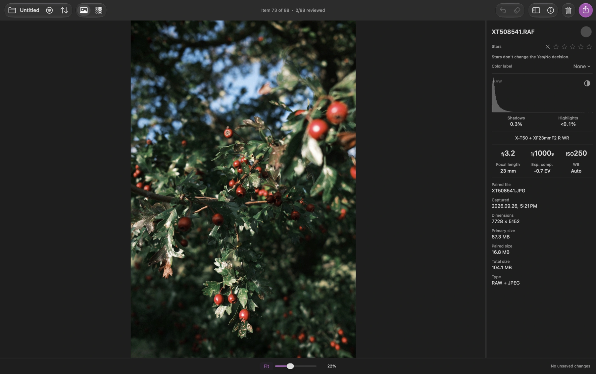
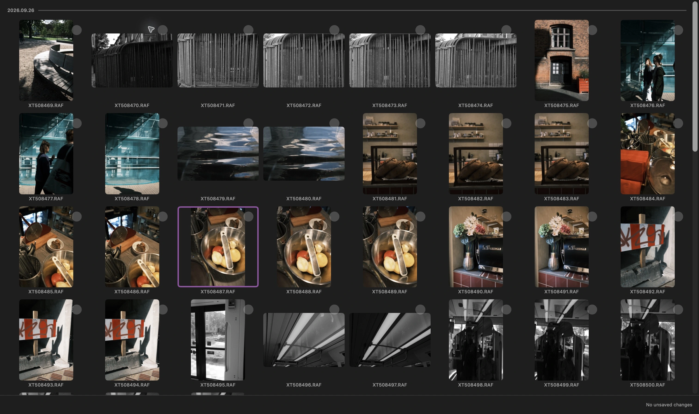

# Louppe Media Culler

Website: [louppe.eu](https://louppe.eu)

Louppe is a fast, keyboard-first, open-source media culler for macOS. Review
photos, video, audio, and text; sort and organize your media; clean up unwanted
files; and export what you want to keep.

macOS 14 or newer on an Apple silicon Mac. The current download does not support Intel Macs.

*Gallery keeps the photo and its information together. Captures show the upcoming
1.9 interface; the current published download is 1.8.*

[Watch the captioned 25-second walkthrough](https://louppe.eu/#review-demo).

## Download

Download **[Louppe.zip from the latest release](https://github.com/alexander-markin-meow/louppe-media-culler/releases/latest)**,
unzip it, and drag `Louppe.app` into Applications.

The public download is signed and notarized by Apple. Open it normally;
macOS may ask you to confirm its first launch.

## Quick start

1. Open a folder or memory card.
2. Review media in Gallery or Grid.
3. Press **F** to mark an item Yes or **D** to mark it No.
4. Filter, sort, select, clean up, organize, or export your media.

*Grid lets you compare nearby frames and select media for the next step.*

The compact bottom panel shows active filters, review status, and saving.
Use its zoom slider or pinch on a photo to adjust magnification, then pan with
two-finger scrolling or click and drag. **S** returns custom zoom to centered
100%, then toggles Fit; **A** still toggles Phone size. **Help → Louppe Help** contains
a quick-start guide and searchable shortcuts. Review tips can be dismissed
and shown again from Help.

Yes/No decisions, stars, and color labels are independent. Marking **No** does
not trash a file. Decisions save automatically; reopen the same folder to
continue. When everything has a decision, the bottom panel confirms the review
is complete. Use the toolbar's Export action and **Keepers (Yes)** to copy them.

With an explicit selection, Export starts with **All selected**. Otherwise,
it starts with **Keepers (Yes)** from the filtered view. Quick picks also
include **4–5 stars**, regardless of Yes/No decision. The inclusion summary
shows how many items match before you choose a destination.

Export copies by default and can also move selected media or write your
decisions, star ratings, and color labels as XMP sidecars—small metadata files
saved beside your media for use in other apps. **Clean Up** sends unwanted
files to the macOS Trash.
**Organize Source Folder** sorts files into folders using decisions, dates,
ratings, camera details, and other metadata.

## Sort, review, and clean up

- Filter and sort by decisions, stars, color labels, dates, folders, camera
  details, file types, and media properties.
- Choose **Sort → Review groups → Analyze Folder Locally** to review exact
  duplicates, likely similar photos, and capture bursts. The analysis stays on
  your Mac and does not change ratings or files automatically.
- In **Filter**, matching RAW+JPEG files can be grouped as one
  review item while keeping separate decisions, stars, and color labels.
- **Clean Up** supports All Media, Filtered, or Selected items, including
  options to move only the JPEG or only the RAW from an unambiguous pair to the
  macOS Trash. **⌘Z** can restore a cleanup while the files remain in the
  Trash.
- **Organize Source Folder** previews nested folders such as Decision → Date
  before moving items. **Rename Files…** supports single files and metadata-
  based batches; extensions stay unchanged and recognized RAW+JPEG/XMP
  families follow together.

## Export and file handling

Export can copy or move All Media, Filtered, or Selected items. **Route copies
to multiple folders** lets you send media to different destinations using
explicit decision, rating, color, file-type, or media-type rules; Louppe
previews the complete plan before copying.

Ratings save automatically in `.louppe_session.json` inside the opened folder.
When a folder or card is unavailable, Louppe can use an identity-bound local
backup to protect the session.

## Media and inspection

Louppe supports common camera RAW, JPEG, TIFF, PNG, HEIC, WebP, AVIF, photo,
video, audio, and text formats. Unsupported files still appear in the review so they
can be rated and exported.

Gallery includes a zoom slider and pinch-to-zoom, Fit, phone-sized preview,
true 100% zoom, video and audio
playback, metadata, a histogram, clipping information, and optional quality
cues. VoiceOver is supported, and the main review workflow can be completed
with the keyboard.

Text previews are read-only, selectable, and set in a serif font. TXT, TEXT,
Markdown (MD/MARKDOWN), XML, JSON, CSV, TSV, LOG, YAML, and YML files appear
alongside other media. Markdown displays headings, lists, bold, italic, and
clickable web/email links; other formats display their original text. Previews
support UTF-8 and BOM-marked UTF-16/32, up to 1 MiB per file.

## Keyboard shortcuts

Shortcuts work while reviewing media. Text fields, dialogs, and native macOS
controls keep their normal shortcuts.

| Shortcut | Action |
|---|---|
| **F** | Mark Yes and move to the next undecided item |
| **D** | Mark No and move to the next undecided item |
| **0–5** | Clear or assign a 1–5 star rating |
| **← / →** | Previous / next item; in Gallery video, seek 0.5 seconds |
| **↑ / ↓** | Previous / next item in Gallery; previous / next row in Grid |
| **J / L** | Previous / next item |
| **Space / K** | Play or pause video/audio; Space advances on photos |
| **Shift + ← / →** | Seek 5 seconds in Gallery video |
| **S** | Toggle true 100% zoom in Gallery |
| **A** | Toggle phone-sized preview in Gallery |
| **X** | Show or hide the clipping overlay in Gallery |
| **Tab / G** | Switch between Gallery and Grid |
| **Q** | Show or hide the Gallery thumbnail browser |
| **W** | Show or hide the Info panel |
| **⌘+ / ⌘−** | Make Grid thumbnails larger / smaller |
| **E / ⌘E** | Open Export |
| **R** | Clear all Yes/No decisions |
| **Z / ⌘Z** | Undo the latest review or file action |
| **⌘O** | Open another folder |
| **⌘R** | Rescan the current folder |
| **⌘F** | Open Filter and focus Search |
| **⌘K** | Open the Command Palette |
| **⌘A** | Select all visible items |
| **⌘← / ⌘→** | Slower / faster playback; previous / next item for photos |
| **⌘⇧← / ⌘⇧→** | Select from the current item to the first / last |
| **Esc** | Cancel a scan or clear the current selection |
| **⌘⌫** | Send the selection to the macOS Trash without a dialog |

For development, performance, release, and App Store notes, see
[AGENTS.md](AGENTS.md), [Docs/PERFORMANCE.md](Docs/PERFORMANCE.md),
[Docs/UPDATES.md](Docs/UPDATES.md), and [Docs/APP_STORE.md](Docs/APP_STORE.md).

Louppe is free and open source under the [MIT License](LICENSE).

Created by [Alex Markin](https://alex-markin.com); contact: a@alex-markin.com
